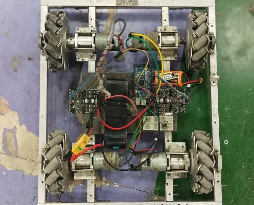

# Control of Mecanum Wheels Robot

A robotics project aimed at developing a mobile platform capable of omnidirectional motion using Mecanum wheels. This robot is controlled via Bluetooth using an Android smartphone and is built on the Arduino platform.

 <!-- Add image if available -->

## Features

- Omnidirectional movement (forward, backward, sideways, rotation)
- Bluetooth remote control via Android app
- Sinusoidal trajectory execution
- Modular code with support for future IMU/Encoder integration
- Custom PCB design (planned for future implementation)

## Components Used

- Arduino Mega ADK
- MDD10A Dual Channel Motor Drivers
- 12V DC Motors with Mecanum wheels
- LiPo Battery (12V, 1100mAh)
- Bluetooth HC-05 Module
- MPU6050 IMU
- Rotary Encoders
- Android App: Arduino Car
- Custom PCB (Designed in Altium, not used in final setup)

## Mechanics of Mecanum Wheels

Each wheel has angled rollers (approximately 45°) allowing vector control of movement. By varying the speed and direction of each wheel, the robot can:

- Move forward/backward
- Strafe left/right
- Rotate in place
- Move diagonally or follow complex paths

## Implemented Functions

- `forward()`, `backward()`, `left()`, `right()`
- `rotateL()`, `rotateR()`
- `moveSineWave(amplitude, frequency)`
- Bluetooth command parsing for real-time control
- Additional standalone scripts for:
  - IMU data collection
  - Encoder-based motor position tracking

## Code Structure

- `main.ino`: Core control logic, movement functions, Bluetooth command parsing
- `imu.ino`: Reads acceleration from MPU6050
- `encoder.ino`: Tracks motor shaft rotation using encoders

## Known Issues

- Sine wave motion is simulated, not based on actual position feedback
- Speed control via app is not functional (pending serial communication fix)
- Back-right wheel lag was fixed by tightening a loose Allen key

## Future Improvements

- Switch to custom PCB for robustness
- Integrate PID control using IMU and encoders
- Fix serial communication to enable dynamic speed control

## Repository

Source code and documentation:  
[Control-of-Mecanum-wheels GitHub Repo](https://github.com/nrk-necro/Control-of-Mecanum-wheels.git)

## Contributors

- Madhupriya  
- Raj  
- Nithish
